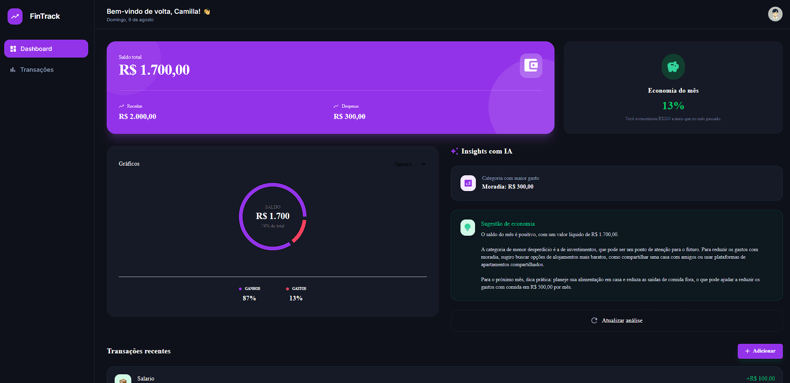
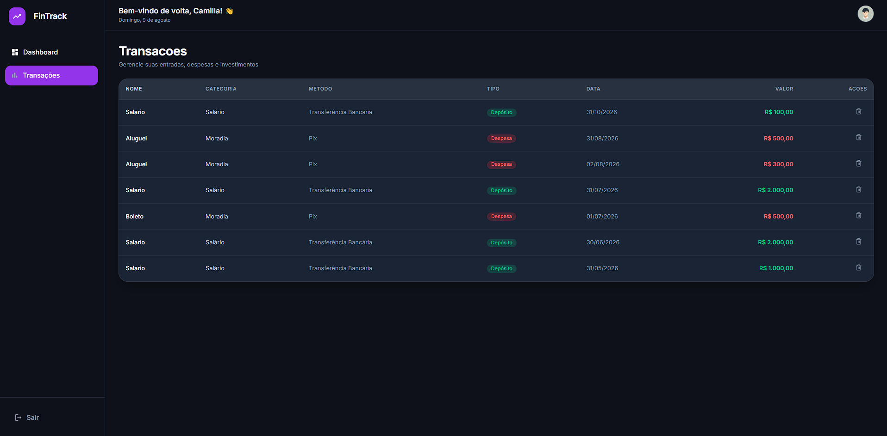
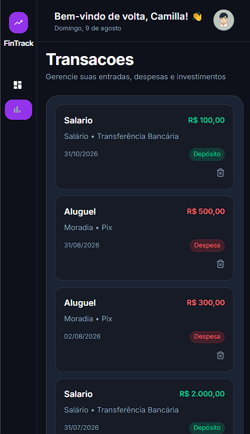
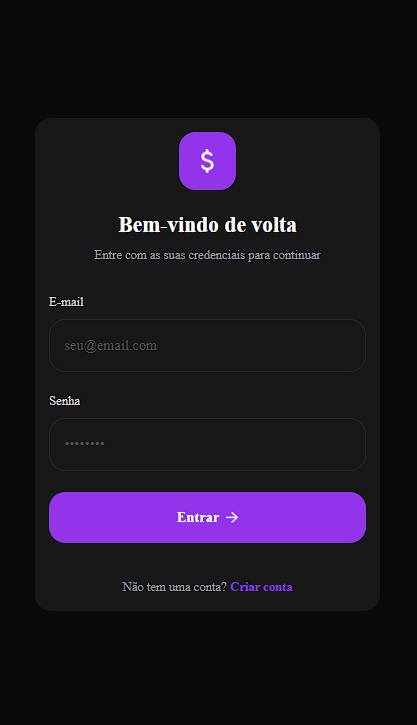

# 💰 FinTrackAI — Controle Financeiro com Insights Inteligentes


## Deploy da aplicação 

[](https://fintrack-ai-dashboard-arthurmdev.vercel.app/sign-in)

## Sobre o Projeto

O **FinTrackAI** é uma aplicação fullstack de controle financeiro com geração automática de insights utilizando IA. Desenvolvida para ajudar o usuário a organizar suas finanças e tomar decisões mais conscientes com base nos próprios dados.

Além das funcionalidades tradicionais de um sistema financeiro o projeto conta com uma integração com IA, que gera **insights automáticos e contextualizados** com base nas transações do usuário.

---

## Insights com IA

Diferente de um CRUD comum, o FinTrackAI utiliza inteligência artificial para:

* Analisar os gastos do mês atual
* Identificar a categoria com maior impacto financeiro
* Sugerir formas de economia para o próximo mês
* Gerar um resumo textual sobre o comportamento financeiro

Esses insights são gerados dinamicamente com base nos dados reais do usuário.

---

## Funcionalidades

* Criar novas transações financeiras
* Editar transações existentes
* Visualizar dashboard com métricas financeiras
* Comparar economia entre meses
* Categorizar gastos
* Visualizar gráficos de distribuição de gastos
* Receber insights financeiros com IA
* Sistema de autenticação de usuários
---

## Tecnologias Utilizadas

### Frontend & Backend


### Autenticação & Validação


### Estilização & UI


### Banco de dados & ORM


### Inteligência Artificial

> **Modelo:** LLaMA 3.1 8B Instant (via Groq Cloud API)

>**SDK:** OpenAI-compatible client

---

## Aprendizados
Desenvolvi este projeto para consolidar meus conhecimentos em desenvolvimento fullstack com Next.js, trabalhando com autenticação, validação, banco de dados, CRUD e integração com uma API de inteligência artificial.


## Pré-requisitos

- Node.js 20+
- PostgreSQL
- npm
- Uma chave da API da Groq

##  Como rodar o projeto

### 1. Clonar o repositório

```bash
git clone https://github.com/Arthurthedev/fintrack-ai-app
cd findtrack-ai-app
```

---

### 2. Instalar dependências

```bash
npm install
```

---

### 3. Configurar variáveis de ambiente

Copie o arquivo de exemplo:

```bash
cp .env.example .env
```

---

### 4. Rodar migrations do banco

```bash
npx prisma migrate dev
```

---

### 5. Rodar o projeto

```bash
npm run dev
```

---

### 6. Acessar no navegador

```
http://localhost:3000
```
## Demonstração





---
##  Licença

Este projeto está sob a licença MIT.

##  Autor

**Arthur**
* LinkedIn: [LinkedIn](https://www.linkedin.com/in/arthur-moraes-b44803261/)
* GitHub: [@Arthurthedev](https://github.com/Arthurthedev)